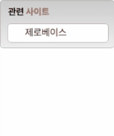

# Transition

---
### 마크업
&lt;div&gt; > &lt;aside&gt; >&lt;h3&gt;, &lt;ul&gt; > &lt;li&gt;
1. 전체 태그를 div 태그로 감싸 큰 컨테이너 부분을 제작했습니다.
2. aside 태그를 활용하여 관련 사이트 배경을 만들었습니다.
3. h3 태그를 활용하여 '관련 사이트' 제목을 표기했습니다.
4. ul, li 태그를 활용하여 관련 사이트 리스트 목록을 표기했습니다.

### CSS
1. &#42;  
전체 CSS에 '프리텐다드' 폰트를 적용했으며, margin, padding 을 각각 0으로 초기화 했습니다. 

2. &lt;div&gt; (.relatedSites)  
width : 190px, height 80px 로 지정하여 영역을 잡아주었습니다.

3. &lt;aside&gt; (.relatedSitesContainer)  
background linear-gradient 를 활용하여 배경 색을 지정했습니다.  
margin 20px, width 190px, height 80px, padding 8px 12px 로 컨테이너의 크기를 지정했습니다. 
border을 활용하여 테두리를 적용했습니다. 
transition: all, 0.5s를 적용하여 변화 시간을 지정해주었습니다. 

4. &lt;h3&gt; (.relatedSitesTitle)  
font-size 15px, font-weight 700으로 폰트를 적용했습니다. 
line-height, margin을 활용하여 위치와 크기를 설정했습니다. 
'사이트' 텍스트는 &lt;span&gt; 태그로 감싸 컬러값 #ED552F를 지정하였습니다. 

5. &lt;div&gt;:hover > &lt;aside&gt; (.relatedSites:hover > .relatedSitesContainer)  
- aside (.relatedSitesContainer) :hover  
전체 컨테이너를 hover 했을 때 width 190px, height 196px로 크기를 설정하고, 
transition: all 0.5s 값을 설정하여 부드럽게 동작할 수 있도록 transition을 적용했습니다.

6. &lt;ul&gt; (.relatedSitesList)  
list-style:none 으로 리스트의 불릿 기호를 제거하였습니다.  
background: white 컬러로 배경색을 지정하였습니다.  
width 166px, height 30px로 관련 사이트 리스트 박스의 크기를 지정하였습니다.  
border, border-radius 를 통해 테두리와 둥글기를 설정했습니다.  
overflow: hidden을 사용하여 첫번째 li 요소만 화면에 보일 수 있도록 설정했습니다.  
transition: all 0.5s 를 지정하여 hover 후에 원래 상태로 부드럽게 복구할 수 있도록 설정했습니다.  

7. &lt;div&gt;:hover > &lt;ul&gt; (.relatedSites:hover .relatedSitesList)  
- ul (.relatedSitesList) :hover  
width 166px, height 145px로 hover 되었을 때 크기를 지정하였습니다.  
transition: all 0.5s 값을 설정하여 부드럽게 동작할 수 있도록 transition을 적용했습니다.

8. &lt;li&gt; (.relatedSitesList)  
margin 24px, padding 4px로 여백을 설정했습니다.  
transition: all 1s로 다른 hover의 transition 보다 늦은 속도를 지정하였습니다.  
transition-delay: 0.5s로 transition이 0.5초 느리게 시작할 수 있도록 설정했습니다.  

9. &lt;ul&gt;:hover > &lt;li&gt; (.relatedSites:hover .relatedSitesitem)  
- li (.rekatedSitesitem) :hover
padding 4px를 지정하여 여백을 설정하였습니다.  
transform: translate(0, 20%) 속성을 사용하여 li 요소들이 Y축으로 20% 이동할 수 있도록 설정했습니다.  
transition: all 1s로 다른 hover의 transition 보다 늦은 속도를 지정하였습니다.  
transition-delay: 0.5s로 transition이 0.5초 느리게 시작할 수 있도록 설정했습니다.  