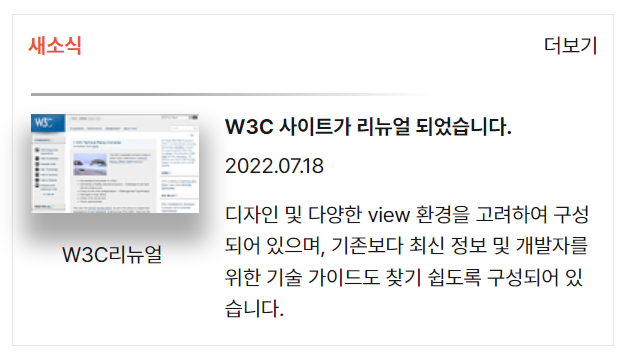

# grid 활용 과제

## 마크업
---
1. 전체 태그를 &lt;section&gt;으로 묶어주었습니다.  
2. &lt;section&gt;태그 자식 요소로 '새소식' 제목을 &lt;h2&gt;로 지정하고,  
형제 요소로 &lt;div&gt;태그를 만들었습니다.  
3. &lt;div&gt;안에 각각 &lt;figure&gt;을 활용한 이미지, &lt;ul&gt;을 활용하여 글 목록을 작성했습니다.  
4. &lt;figure&gt;태그 안에 &lt;img&gt;에 이미지를 설정하고, &lt;figcaption&gt;을 활용하여 이미지 하단의 텍스트를 작성했습니다.  
5. &lt;ul&gt; 태그의 자식 요소로 &lt;li&gt;태그에 목록의 제목과, 내용을 작성하고, &lt;time&gt;태그로 목록의 작성 일자를 설정했습니다.  

## CSS
---
1. &#42;
- 전체 요소에 list-style : none 을 지정하여 스타일을 제거했습니다.
- 에이전트 스타일의 margin, padding 값을 초기화 했습니다.
- font-family, font-weight, font-size, color을 지정하였습니다.

2. &lt;section&gt; (.newsContainer)
- 화면에서 띄우기 위해 margin 값을 임의로 지정하였습니다.
- 임의로 padding 값을 지정하여 container에 여백을 주었습니다.
- 임의로 border 값을 지정하여 영역을 표시하였습니다.
- height, width 값을 각각 지정하였습니다.
- position : relative 를 설정하여 position의 기준점을 만들었습니다.

3. &lt;h2&gt; (.news)
- color 값을 #ED552F로 지정하였습니다.
- font-size, font-weight, line-height 로 텍스트의 속성을 설정하였습니다.

4. &lt;div&gt; (.newContainerBox)
- display: grid를 지정하여 이미지와 텍스트 영역으로 나누어 영역을 설정했습니다.
- padding-top에 값을 주어 여백을 주었습니다.
- position: absolute 를 bottom에 지정하여 여백을 주었습니다.
- div 박스 상단에 border-width로 두께를 초기화하고, border-style과 border-image를 적용하여 상단의 그라디언트되는 border를 만들었습니다.

5. &lt;figure&gt; (.imgBox)
- &lt;img&gt;와 &lt;figcaption&gt;을 감싼 figure 태그에 grid-area : 1 / 1 / 3 / 2를 적용하여 좌측에서 열 방향 2칸을 차지할 수 있도록 설정했습니다.

6. &lt;img&gt; (.newsImage)
- box-shadow로 box의 그림자 효과를 주었습니다.

7. &lt;figcaption&gt; (.imgBox > figcaption)
- margin 값을 주어 이미지와의 거리를 띄우고 중앙에 정렬하였습니다.

8. &lt;ul&gt; (.newsList)
- 전체 ul에 width와 height로 크기를 지정하고, margin 값을 주어 여백을 확보했습니다.
- grid-area : 1 / 2 / 3 / 3을 적용하여 우측에 위치시켰습니다.
- display : gird 를 지정하여 자식 요소인 &lt;li&gt; 와 &lt;time&gt;태그를 정렬하기 위해 grid-container로 설정하였습니다.
- grid-column : 1fr 1fr 1fr로 열을 3칸으로 나누었습니다.

9. &lt;li&gt; (.newsTitle)
- font-size, font-weight를 지정하였습니다.

10. &lt;time&gt; (.newsTime)
- margin-top 값을 주어 제목 부분과의 여백을 지정하였습니다.

11. &lt;li&gt; (.newsText)
- margin-top 값을 주어 시간 부분과의 여백을 지정하였습니다.
- line-height를 통해 행간 간격을 조절하였습니다.

12. &lt;a&gt; (.viewMore)
- text-decoration: none 값을 지정하여 초기화 시킨 후, line-hight로 태그 텍스트의 높이를 지정하였습니다.
- position: absolute 지정 후, top, right 값을 주어 상단 우측에 위치할 수 있도록 배치하였습니다.