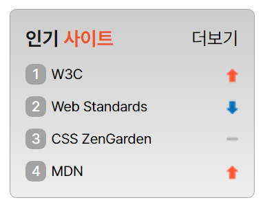

# Sprite 과제

#### result

## 마크업
---
&lt;section&gt; &gt; &lt;h2&gt; | &lt;ol&gt; > &lt;li&gt; &gt; &lt;a&gt; &lt; &lt;a&gt;
 
1. 전체 컨테이너를 &lt;section&gt; 태그로 묶어주었습니다.
2. &lt;section&gt; 자식 요소로 &lt;h2&gt;와 &lt;ol&gt; 요소를 지정했습니다.
3. &lt;ol&gt;의 자식 요소로 &lt;li&gt;태그, &lt;li&gt; 태그의 자식으로 &lt;a&gt;를 지정했습니다.
4. '더보기'를 a태그로 지정하였습니다.
 
## CSS
---
1. &#42;
- 전체 선택자를 통해 에이전트 스타일 margin, padding의 값을 초기화합니다.
- 프리텐다드로 폰트를 지정합니다.

2. &lt;section&gt; (.favoriteSite)
- box-sizing을 border-box로 지정 후 margin과 padding의 값을 적용합니다. 
- position:relative를 통해 position의 기준점을 정합니다.
- width, height로 박스의 크기를 지정합니다.
- background, border 속성으로 그라디언트와 테두리를 설정합니다.

3. &lt;h2&gt; (.favoriteSiteTitle)
- '인기 사이트'의 컬러와 폰트 굵기, 사이즈, line-height를 지정합니다.
- &lt;h2&gt; &gt; &lt;span&gt;태그에 #ED552F 컬러를 적용합니다.

4. &lt;ol&gt; (.favoriteSiteList)
- list-style 기본값을 제거합니다.
- 자식 요소인 &lt;li&gt;태그의 정렬을 위해 display: flex를 적용합니다.
- flex 메인축을 column으로 설정합니다.
- margin, gap 값을 추가하여 여백을 설정합니다.

5. &lt;li&gt; (.favoriteSiteItem)
- counter-increment: number으로 li태그 앞에 순차적으로 번호를 부여합니다.
- font-size, line-height로 폰트 속성을 지정합니다.
- background 이미지로 up,down 이미지를 삽입하고 반복되지 않도록 no-repeat를 설정합니다.
- 해당 영역에만 이미지가 보일 수 있도록 높이 값을 지정합니다.

6. &lt;li&gt; (.Rank1|.Rank2|.Rank3|.Rank4|.Rank5)
- background-position을 통해 각각 랭크의 up,down 표시가 알맞게 될 수 있도록 값을 지정합니다.

7. &lt;li&gt; &gt; &lt;a&gt;
- text-decoration 속성을 통해 a태그의 기본 속성을 초기화합니다.
- 폰트의 컬러를 지정합니다.

8. &lt;li&gt;::before (.favoriteSiteItem::before)
- &lt;li&gt;앞에 숫자를 부여하기 위해 가상요소를 선택합니다.
- content: counter(number)를 통해 숫자를 부여합니다.
- display: inline-block으로 설정하여 width와 height를 지정합니다.
- 필요한 여백의 margin을 지정합니다.
- border-radius, background를 설정합니다.
- 폰트의 line-height를 150%로 지정하고 text-align : center 값으로 텍스트를 중앙 정렬하고, 폰트의 컬러를 설정합니다.

8. &lt;a&gt; (.viewMore)
- position:absolute를 지정하고 top, right 값을 통해 컨테이너 박스를 기준으로 상단 우측에 위치할 수 있도록 설정합니다.
- font-size, line-height, tex-decoration, color의 속성 값을 통해 폰트를 설정합니다.
